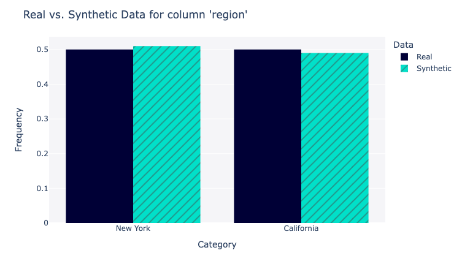

# Time Series Metrics

## Installation
Create and enter the anaconda virtual environment
```Bash
conda create --name <your_env_name> python=3.9
conda activate <your_env_name>
```

Install packages and dependencies
```
pip3 install -e .
```

## Implemented metrics

A list of implemented metrics:

- [x] [Attritube distributional similarity (single or multiple)](./fidelity/attr_dist_similarity.py)
- [x] [Single attirubte coverage](./fidelity/single_attr_coverage.py)
- [x] [Number of records per object](./fidelity/session_length_dist_similarity.py)
- [x] [Feature distribution similarity (single or multiple)](./fidelity/feature_dist_similarity.py)
- [x] [Cross-feature correlations](./fidelity/cross_feature_correlation.py)
- [x] [Per-feature autocorrelation](./fidelity/perfeature_autocorrelation.py)
- [x] [Inter-arrival time](./fidelity/interarrival_dist_similarity.py)
- [x] [Qualitative metadata-feature correlation](./fidelity/single_attr_single_feature_correlation.py)

All the timeseries metrics are subclasses form the `sdmetrics.timeseries.TimeSeriesMetric`
class, which can be used to locate all of them:

```Python
from sdmetrics.timeseries import TimeSeriesMetric
TimeSeriesMetric.get_subclasses()
```

## Usage
### Report (a set of metrics)
Get started with **SDMetrics Reports** using `sunglasses` demo data and [configuration file](../reports/timeseries/sunglasses_qr.json)

```Python
from sdmetrics.demos import load_timeseries_demo
from sdmetrics.reports.timeseries import QualityReport

real_data, synthetic_data, metadata = load_timeseries_demo()

my_report = QualityReport(config_file="sunglasses_qr.json")
my_report.generate(real_data, synthetic_data, metadata)
my_report.visualize()
```
which will generate a web report containing numerical values and visual plots.

The user's [customized config file](../reports/timeseries/sunglasses_qr.json) will override the [default config file](../reports/timeseries/config_quality_report.json) when in use. For each metric, e.g., `SingleAttrSimilarity`, the configuration has to specifiy

- `class`: the Python class that implemented this metric
- `target_list`: (Optional) specifies the `target column` that the metric would like to be evaluated on.
```Json
"Single attribute distributional similarity": {
    "class": "AttrDistSimilarity",
    "target_list": [
        [
            "store_id"
        ],
        [
            "region"
        ]
    ]
}
```

### Single metric
**Want more metrics?** You can also manually apply any of the metrics in this library to your data. All the timeseries metrics operate on *at least* three inputs:

* `real_data`: A `pandas.DataFrame` with the data from the real dataset.
* `synthetic_data`: A `pandas.DataFrame` with the data from the synthetic dataset.
* `entity_columns`: A `list` indicating which columns represent entities to which
  the different senquences from the dataset belong.

For example, an `SingleAttrDistSimilarity` metric can be used on the `sunglasses` demo data as follows:

```python3
from sdmetrics.demos import load_timeseries_demo
from sdmetrics.timeseries import SingleAttrDistSimilarity

real_data, synthetic_data, metadata = load_timeseries_demo()
scores = SingleAttrDistSimilarity.compute(real_data, synthetic_data, metadata, target=['region'])
```

The output `scores` will contain two parts (if applicable) for each attribute/feature: (1) a numerical number (2) a visualization plot.



### Single dataset
For a quick check on real (or synthetic) dataset alone, you can use `SingleDatasetVisualize`:

```Python
from sdmetrics.demos import load_timeseries_demo
from sdmetrics.reports.timeseries import SingleDatasetVisualize

real_data, synthetic_data, metadata = load_timeseries_demo()

my_report = SingleDatasetVisualize()
my_report.visualize(real_data, metadata)
```
which will generate a set of plots to visualize the distribution of different fields.

### Implement your own metric
Follow the steps to implement new metrics:
1. Create a python file under `sdmetircs/timeseries/[fidelity|privacy]/<metric_name>.py`
2. Create a python class `<metric_class>` in `<metric_name>.py` that subclasses `TimeSeriesMetric`.
3. Implement the *class method* `compute(real_data, synthetic_data, metadata)` of the python class `<metric_class>`. You may add more arguments to the `compute` function.
4. Add new metrics to [quality report configuration file](../reports/timeseries/config_quality_report.json).

---

Additionally, all the metrics accept a `metadata` argument which must be a dict following
the [Metadata JSON schema from SDV](https://docs.sdv.dev/sdmetrics/getting-started/metadata/sequential-metadata), which will be used to determine which columns are compatible
with each one of the different metrics, as well as to extract any additional information required
by the metrics, such as the `entity_columns`.

If this dictionary is not passed it will be built based on the data found in the real table,
but in this case some field types may not represent the data accurately (e.g. categorical
columns that contain only integer values will be seen as numerical), and any additional
information required by the metrics will not be populated.


# TODOs:
- [x] add README on adding new metrics
- [x] Merge multiple plots into one tab
- [ ] save/load reports including figures and numbers
- [x] single dataset visualization
- [ ] Convert matplotlib to plotly
- [ ] Modify metadata def from SDV?
- [ ] Better plot information
- [x] More informative reports
- [ ] Create plot examples for pcap/netflow/wiki
- [ ] Write unit tests

# Issues/Bugs
- [x] Negative `single attribute coverage` (jacaard similarity)
- [ ] [`distribution_similarity`](./utils/distribution_similarity.py) is stuck when the traces are large